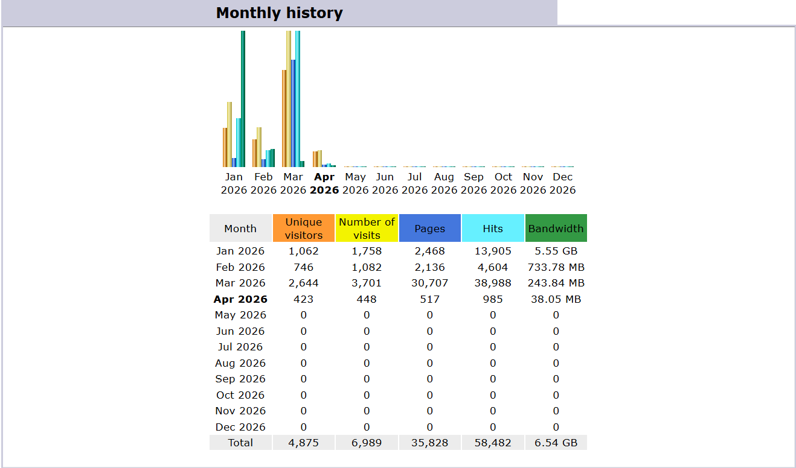

# 🌍 AfricaTravelGo
> A data-driven travel platform providing logistical intelligence for 50+ African destinations.
https://africatravelgo.com

## 📊 Live Project Statistics (Q1 2026)
Since its launch in late 2025, AfricaTravelGo has demonstrated significant growth and technical stability.

| Metric | Quarter Total | Peak Performance (March '26) |
| :--- | :--- | :--- |
| **Unique Visitors** | **4,875** | 2,644/mo |
| **Total Page Views** | **35,828** | 30,707/mo |
| **Total Hits** | **58,482** | 38,988/mo |
| **Data Delivered** | **6.54 GB** | 5.55 GB (Jan) |

### 📈 Technical & SEO Performance
I monitor the site's health using Google Lighthouse/PageSpeed Insights to ensure accessibility for global users.

| Audit Category | Score | Status |
| :--- | :--- | :--- |
| **SEO** | **100/100** | ✅ Optimized |
| **Accessibility** | **98/100** | ✅ Near Perfect |
| **Best Practices** | **69/100** | ⚠️ Improving |
| **Performance (Mobile)** | **71/100** | 📈 Optimizing |

https://pagespeed.web.dev/analysis/https-africatravelgo-com/hgn2d5qego?form_factor=mobile

* **Search Engine Authority:** Achieving a **100/100 SEO score** ensures the site ranks effectively for niche African travel queries.
* **Inclusive Design:** A **98/100 Accessibility score** guarantees that the information is available to all users, regardless of how they navigate the web.
* **Scalability:** Successfully managed a **150% increase in unique visitors** from February to March 2026.
* **Asset Optimization:** Serving **6.54GB of bandwidth** while maintaining a stable mobile performance for regional users.

## 🛠 Tech Stack
* **Frontend:** Semantic HTML5, CSS3 (Modern Grid/Flexbox), JavaScript (ES6).
* **Architecture:** Directory-based routing designed for SEO and high-performance static delivery.
* **Optimization:** Performance-focused asset loading to accommodate low-bandwidth regional users.

## 📑 Case Study: Solving Travel Fragmentation
**The Challenge:** Travel information for the African continent is often fragmented. Travelers struggle to find unified data on border crossings, local costs, and cultural timing.

**The Solution:** I built AfricaTravelGo as a centralized "Intelligence Hub." 
* **Modular Guides:** Engineered 50+ destination files (e.g., Zanzibar, Casablanca, Dakar) using a consistent, SEO-friendly template.
* **User Engagement:** High "Hits to Visit" ratio (approx. 8 hits per visit) indicates strong user navigation through the directory.
* **Safety & Logistics:** Integrated high-value "Practical" modules for visas and safety updates.
